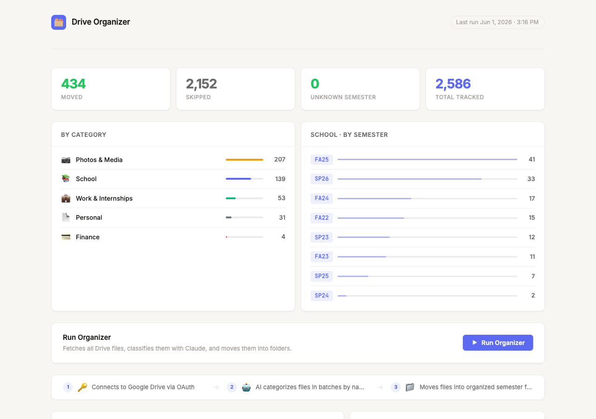
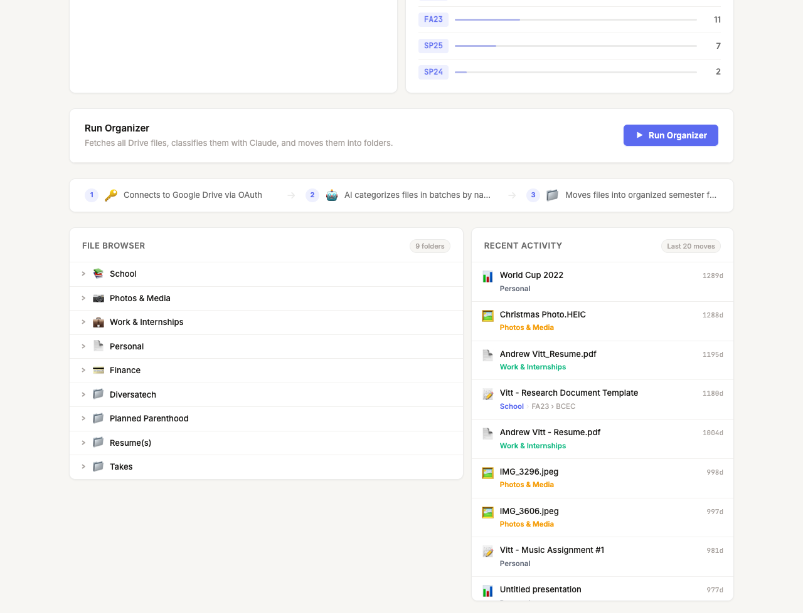

# Drive Organizer

AI-powered Google Drive organization. Fetches every file in your Drive, sends them to Claude in batches for classification, and moves each one into a clean folder hierarchy — with a three-layer date pipeline that gets semester or time-period placement right without manual labeling.

Includes a web dashboard for viewing stats, browsing your organized Drive, and re-running the organizer.

---

## What it does

- **Discovers** every file in My Drive via the Drive API (paginated, handles 2,000+ files)
- **Classifies** files in batches of 30 using Claude — each file gets a destination path like `School/FA24/CS 101` or `Work & Internships`
- **Infers time period** from file creation and modification dates so you don't have to label anything
- **Moves** files into the correct folders, creating the hierarchy on the fly as needed
- **Resumes** interrupted runs from where they left off — no reprocessing, no duplicates
- **Dashboard** for stats, a live streaming log, an interactive Drive file browser, and a recent-activity feed

---

## Who it's for

**Students** — Course files from multiple semesters accumulate into an unsearchable flat pile. Drive Organizer routes them to `School/SEMESTER/COURSE/` automatically, using file creation dates to assign the correct semester.

**Professionals** — Work documents, contracts, and project files get routed to `Work & Internships` or a custom top-level folder. Personal docs, photos, and financial records each get their own category.

**Anyone** — If you've been dropping files into Google Drive for years and can never find anything, this fixes that in one run.

---

## Screenshots



*Stats cards, category and semester breakdowns, and the run button.*



*Interactive file browser with lazy-loaded Drive folders, and a recent-activity feed showing the last 20 moved files.*

---

## How it works

### File discovery

`organizer.py` authenticates via OAuth and lists every non-trashed file in My Drive. Each file's `id`, `name`, `mimeType`, `createdTime`, and `modifiedTime` are fetched in a single paginated call. Files that already live in an organized folder (i.e., not directly in Drive root) are skipped for speed.

### AI categorization

Files are sent to Claude in batches of 30. For each file, Claude returns a destination path:

```
School/FA24/CS 101
Work & Internships
Photos & Media
Personal
Finance
```

Batch size is a cost and latency tradeoff — 30 files per call keeps costs low while giving Claude enough context per file.

### Three-layer semester pipeline

Semester assignment is the hardest part of the problem. A file named `HW3.pdf` carries no temporal signal. The solution stacks three layers, each overriding the previous:

1. **Creation date** — `createdTime` from the Drive API, mapped to a semester label using the `date_to_semester()` function. Edit this function to match your institution's academic calendar or replace it with any date → label mapping.
2. **Modified date fallback** — if `modifiedTime` is 6+ months after `createdTime`, the modified date is used instead. Handles files created early and filled in later.
3. **Course → semester map** — a dictionary in `config.json` that wins unconditionally. Use this for courses where the date heuristic would be wrong.

### Post-processing

Before any file moves, each path goes through:
- **Course name normalization** — maps variant names (`CS61B → CS 61B`, `Calc → Math 1A`) to canonical folder names so duplicate folders don't appear
- **Semester override** — applies the `course_semester_map` as a final correction layer

### Resumable execution

After each batch, processed file IDs are saved to `progress.json` as a `{file_id: destination_path}` map. If the run is interrupted, it resumes exactly where it left off. The same file is never processed twice in a single logical run.

---

## Getting started

### Prerequisites

```bash
pip install google-auth-oauthlib google-api-python-client anthropic python-dotenv flask
```

Python 3.9+ required.

### Google OAuth credentials

1. Open [Google Cloud Console](https://console.cloud.google.com/) → APIs & Services → Library
2. Enable the **Google Drive API**
3. Go to Credentials → Create Credentials → OAuth 2.0 Client ID → Desktop app
4. Download the JSON file, rename it to `credentials.json`, and place it in the project root

On first run, a browser window opens for OAuth consent. Afterward, `token.json` handles re-authentication automatically. Both files are gitignored.

### Anthropic API key

```bash
cp .env.example .env
# Add your key:
# ANTHROPIC_API_KEY=sk-ant-...
```

### Configuration

```bash
cp config.example.json config.json
# Fill in your details
```

`config.json` is gitignored. `config.example.json` (committed) is the starting template.

---

## Configuration

### config.json schema

```json
{
  "owner_name": "Alex",
  "owner_context": "a college student double-majoring in CS and economics",
  "default_org_semester": "FA25",
  "course_normalizations": {
    "CS61A": "CS 61A",
    "Calculus": "Math 1A",
    "Anthropology": "Anthro 2AC"
  },
  "course_semester_map": {
    "CS 61A": "FA23",
    "Math 1A": "SP24",
    "Anthro 2AC": "FA24"
  }
}
```

| Field | Purpose |
|---|---|
| `owner_name` | Your name — included in the Claude prompt for context |
| `owner_context` | A short description of you — helps Claude with ambiguous files |
| `default_org_semester` | Fallback semester label for student org or work files |
| `course_normalizations` | Maps spelling variants to the canonical folder name |
| `course_semester_map` | Final-authority override: course name → correct semester |

### Folder taxonomy

The default structure:

```
School/
  FA22/  SP23/  FA23/  SP24/  FA24/  SP25/  FA25/  SP26/
    (course name)/
Work & Internships/
Personal/
Finance/
Photos & Media/
(Student Org)/
  SP26/
    Finance/  Events/  Recruitment/  Operations/  Marketing/
```

To change the top-level categories, edit `CATEGORY_META` in `app.py` and the classification prompt in `organizer.py`. The semester date ranges are in the `date_to_semester()` function — update them to match your academic calendar.

### Course normalizations

`course_normalizations` is applied first. It handles:
- **Spacing** — `CS61B → CS 61B`
- **Abbreviations** — `Anthropology → Anthro 2AC`
- **Department renames** — `INDENG 142A → IEOR 142A`
- **Common aliases** — `Calc → Math 1A`

`course_semester_map` is applied after normalization. Keys must match the *canonical* name (post-normalization), not the raw Claude output.

---

## Running

### Live run

```bash
python3 organizer.py
```

Fetches all files, classifies them in batches, moves each one. Prints a summary on completion.

### Dry run

```bash
DRY_RUN=True python3 organizer.py
```

Prints every intended move without touching Drive. No folders are created, no files are moved. Use this as a pre-flight check.

### Stats (no API calls)

```bash
python3 organizer.py --stats
```

Reads `progress.json` and prints a summary of the last run: total moved, skipped, unknown semester, and a file count per top-level folder. No Drive or Anthropic API calls required.

### Web dashboard

```bash
python3 app.py
# Open http://localhost:5000
```

The dashboard shows:
- **Stats cards** — moved, skipped, unknown semester, total tracked
- **Category and semester breakdowns** with animated progress bars
- **Run button** — streams live log output via Server-Sent Events while the organizer runs
- **How it works** — three-step summary of the pipeline
- **File browser** — interactive Drive explorer; click any category to expand it into semester folders, then into individual files
- **Recent activity** — the last 20 moved files with destination path and relative timestamp, fetched from the Drive API

---

## Cleanup utilities

**`delete_empty_folders.py`** — Finds and deletes every empty folder in My Drive, iterating until no more remain. Run this after a reorganization to clean up folders left behind at the source.

```bash
python3 delete_empty_folders.py
```

---

## Results from a production run

Run across a 4-year personal Drive with 2,500+ accumulated files:

| Metric | Value |
|---|---|
| Total files found | 2,583 |
| Successfully categorized and moved | 434 |
| Skipped (unowned / permission errors) | 1,609 |
| Unknown Semester | **0** |
| Empty folders deleted (post-run) | 92 |
| Batches processed | 173 |
| API retry events (rate limits) | ~8 batches, all recovered |

**Why is the skipped rate so high?** Files owned by shared or organizational Google accounts appear in your personal Drive listing but are immovable by a non-owner. These are logged as skipped but don't interrupt the run. The 434 successfully moved files represent essentially the entire personally-owned file corpus.

**Destination breakdown:**

| Folder | Files |
|---|---|
| Photos & Media | 207 |
| School | 139 |
| Work & Internships | 53 |
| Personal | 31 |
| Finance | 4 |

**Zero Unknown Semester** is the standout result. The three-layer pipeline — creation date → modified date fallback → course map override — assigned a correct semester to every single school file without a manual guess.

---

## Limitations

**Shared files can't be moved.** Files owned by an org account show up in your listing but are immovable. They're logged as skipped.

**Generic filenames.** Files named `HW3.pdf` or `Notes` carry no course signal and rely entirely on creation date for semester placement.

**No undo.** `progress.json` records where each file went, giving you a reference map — but reversing moves requires a manual script or restoring from a Drive snapshot.

**Academic calendar assumptions.** `date_to_semester()` maps calendar months to semester labels using a specific date range. Edit it for your institution or replace it with any date → label function for non-academic use.

---

## Contributing

Issues and pull requests welcome. High-impact areas:

- **Incremental runs** — filter `modifiedTime > lastRun` to process only new files
- **Confidence scoring** — have Claude return a confidence estimate; route low-confidence files to `Review/` for human verification
- **Multi-account support** — separate credential sets for personal and organizational Drives
- **Config-driven taxonomy** — move the top-level category list and prompt into `config.json` so no source code changes are needed

---

## License

MIT
